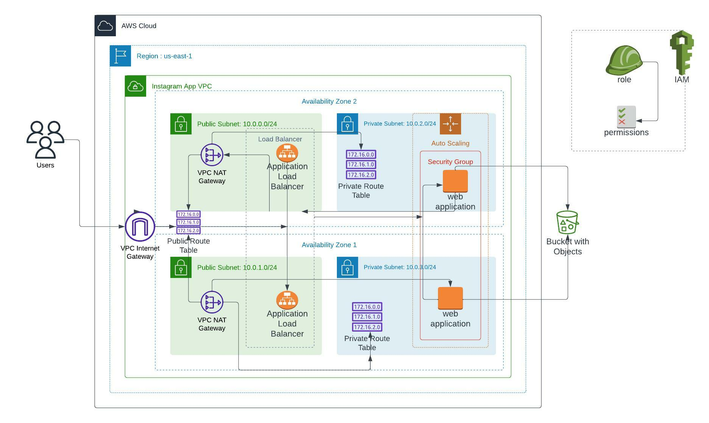

# Deploy-a-High-Availability-Web-App-using-CloudFormation
- Personal Solution to the 2nd Project of Udacity CloudDevops Nanodegree Program

## Problem Description 
```
In this project, you’ll deploy web servers for a highly available web app using CloudFormation. You will write the code 
that creates and deploys the infrastructure and application for an Instagram-like app from the ground up. 
You will begin with deploying the networking components, followed by servers, security roles and software.
```

## Project Requirements
```
1. Develop a diagram that acts as a visual aid to the cloud formation script
2. Interpret the diagram and create a cloud formation script
```
## Project Diagram


### Network Infrastructure Template
> [File that builds the network infrastructure](https://bit.ly/deploy-network)

### Server Infrastructure Template
> [File that builds the server infrastructure](https://bit.ly/deploy-servers)

## Deployment

```
Running the create script, creates a stack:
./create.sh [Name your Stack] [filename] [file name]

Running the update script, updates the stack:
./update.sh [Name your Stack] [filename] [file name]

Running the delete script, destroys your stack:
./delete.sh [Name your Stack [filename] [file name]

```
